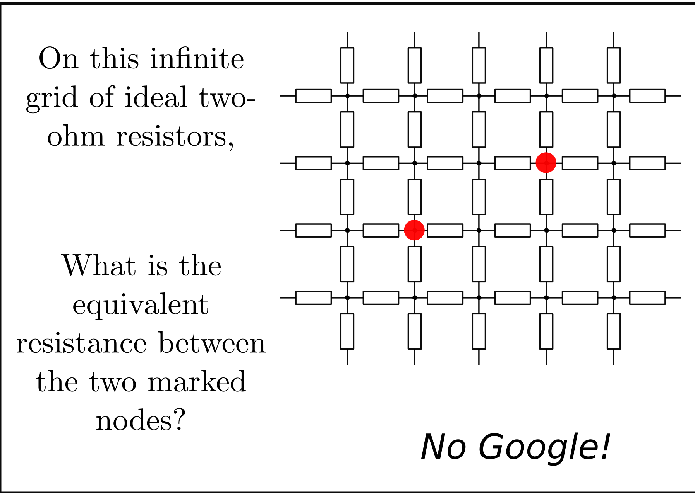

nerd-sniping-postcards
==================

Nerd sniping was popularised in [xkcd #356](http://xkcd.com/356/). 

I saw this, thought about the infinute resitor problem, gave up and read the solution.

I then thought "I have friends, they like postcards, they also like hard problems." so I loaded up inskape and made a card with this problem on it and sent it to my friend.

I also realised I have friends who aren't eletrical engineers, but are computer scientists, they would also *love* a postcard from me with a difficult problem on it. So why not send it to them?

Thus nerd-sniping-cards was born

## How do I use them?

1. First think of someone who has done you wrong.
2. Download and print the files onto some nice 230gsm card. You can either print the PNG files or the SVG files from inkscape.
3. Turn it over, put on the address and a stamp, and a little message, something like _Remember to show your working_
4. Post it to them

n.b. I'm from Britian and live in Russia. check the postal rules in your country about sending postcards.
